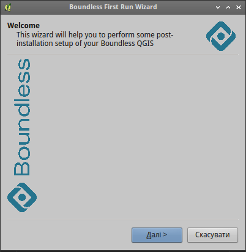
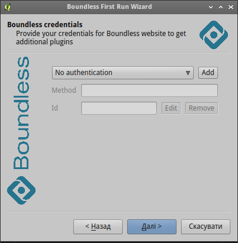
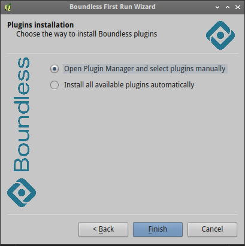

General information
===================

Boundless Central plugin will be the only the one "core" plugin shipped with
our QGIS builds. It will act as "gateway" for all Boundless stuff like:
plugins, tutorials, styles, etc.

Preparation
===========

Boundless Central should be enabled by default in our QGIS build, e.g. via
adding corresponding entry to the Windows registry at the install stage. This
can be done with the following NSIS code
::

  WriteRegStr HKEY_CURRENT_USER "Software\QGIS\QGIS2\Plugins" "boundlesscentral" "true"

Configuration
-------------

There is only one thing to configure now --- repository location. Plugin can
work with standard Boundless plugin repository or install plugins from local
folder (useful for customers with special requirements, when connection to
external resources is not possible).

Repository location configured in the plugin code, in the utils.py file. The
``boundlessRepo`` constant is a tuple containing repository name (will be shown
in QGIS *Plugin Manager*) and repository location.

Repository location can be:

* repository URL. Plugin will add this URL to the list of available plugins
  repositories, so QGIS *Plugin Manager* can be used to access it. This is
  default.
* path relative to the plugin directory. In such case this directory should
  contain plugins packages as well as repository description file plugins.xml.
  Also nothing added to the QGIS settings, as QGIS *Plugin Manager* can not
  handle directories yet.

Usage
=====

First Run wizard
----------------

When QGIS starts, plugin adds Boundless plugin repository to the list of
available plugin repositories if repository location is an URL. If repository
locations is a path, this step skipped.

Also is this is first run of the QGIS with activated plugin, it will show user
the *First Run* wizard.

On next QGIS runs wizard is not shown, but user can open it at any time from
menu *Plugins → Boundless Central → First Run wizard*.

The *First Run* wizard behaves slightly different, depending on the type of
the plugins repository.

If plugins repository specified with an URL Boundless Central will ask user
for credentials used to used to access Boundless plugin repository

And then user can install all available to him plugins from Boundless
repository automatically or start QGIS *Plugin Manager* and select and install
only required plugins manually.

In the latter case in *Plugin Manager* only plugins from Boundless repository
will be shown.

If plugins repository specified with as a path *Boundless Central* does not ask
user for creadentials. All other steps are the same.

Installing plugin from package
------------------------------

If user has a plugin package (e.g. downloaded from any repository or GutHub)
he can easily install it using *Boundless Central*. Just go to the menu
*Plugins → Boundless Central → Installing plugin from ZIP*, browse to the
directory with plugin package and select corresponding file. If this package
is a valid QGIS plugin package it will be installed and activated.

To deactivate or remove plugins installed whis way one can use QGIS *Plugin
Manager* from *Plugins → Manage and Install Plugins...* menu.

Working with local repository
-----------------------------

If plugins repository specified as path, *Boundless Central* plugin will create
additional menu entry in *Plugins → Boundless Central* menu called
*Manage plugins (local folder)*. This menu entry should be used when user wants
to install plugins from Boundless local (directory-based) repository.

To deactivate or uninstall plugins from Boundless local (directory-based)
repository either *Plugin Manager* or *Manage plugins (local folder)* can be
used.

Note: as QGIS *Plugin Manager* does not support directory-based repositories
yet, when users uminstalls plugin, previously installed from Boundless local
(directory-based) repository, a warning will be shown

.. figure:: img/plugin-unintstall.png
  :align: center

This warning can be safely ignored, as users can install uninstalled plugin
again using *Plugins → Boundless Central → Manage plugins (local folder)* menu.
