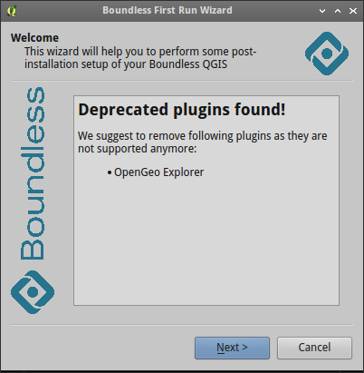
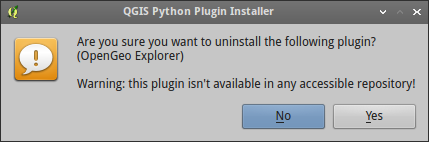

Using Boundless Connect
=======================

When QGIS started for the first time with activated Boundless Connect plugin
(it activated by default in Boundless Desktop) it checks are there Boundless
plugins or not. Then depending on result of this check one of the following
scenaries activated:

* no Boundless plugins found or only some of them installed.
  Boundelss Connect will start *First Run* wizard to help user setup
  Boundless Plugins Repository and install additional plugins. See
  `First Run wizard`_ section for more details.
* all Boundless plugins found and all of them have latest version. User will be
  notified that no additional actions are required.
* all Boundless plugins found but some of them are outdated.
  Boundless Connect will propose user to update plugins automatically. See
  `Updating plugins`_ section for more details.

First Run wizard
----------------

The aim of the *First Run* wizard is to help user to set up Boundless Plugins
Repository and install additional plugins, both Boundless and 3rd party (if
configured by sysadmin).

This wizard started automatically every time when Boundless Connect plugin
updated or QGIS started for the first time with Boundless Connect activated.

If you don't want to go through wizard now, you can safely close it. While
wizard started automatically only once, at first QGIS run, you can open it at
any time from menu *Plugins → Boundless Connect → First Run wizard*.

The first wizard page contains general information about wizard and what it
will do.

.. figure:: img/welcome-page.png
   :align: center

If you have installed unsupported Boundless plugins (plugins which were
replaced with other plugins, e.g. OpenGeo Explorer which is now replaced with
GeoServer Explorer) these plugins will be listed at the welcome page with
suggestion to replace them with new plugins.

Read information on this page and press *Next* button to go to the next page.

At this step *First Run* wizard behaves slightly different, depending on the
Boundless Connect configuration.

If your organization works with remote Boundless Plugins Repository, wizard
will ask you to enter credentials used to access repository, as shown below.

.. figure:: img/credentials-page.png
   :align: center

If plugin was configured to use local directory-based repository, this step is
skipped.

And then user can install all Boundless plugins from QGIS Official Plugins
Repository as well as all available to him plugins from Boundless Plugins
Repository automatically or start QGIS *Plugin Manager* to select and install
only required plugins manually. There is also option to start QGIS
*Plugin Manager* only with Boundless plugins, to simplify installation of
Boundless plugins.

.. figure:: img/plugins-page.png
   :align: center

*NOTE*: deprecated Boundless plugins will not be installed automatically. But
if you already have such plugins installed and there are new versions
available --- they will be updated.

After this Boundless Connect will install additional plugins, if it was
configured to do this by sysadmin.

Updating plugins
----------------

If during first run Boundless Connect found that all Boundless plugins installed
but some of them are outdated, it will propose you to update plugins
automatically:

.. figure:: img/ask-update.png
   :align: center

If you press *Yes* button, all installed Boundless plugins will be updated
automatically. If *No* button pressed nothing happens and you always can update
plugins manually using QGIS *Plugin Manager*.

Managing plugins
----------------

All plugins, added by Boundless Connect plugin can be deactivated or uninstalled
with QGIS *Plugin Manager*.

Plugins installation can be performed in several ways. If your organization
works with remote Boundless Plugins Repository it is necessary to specify
credentials to access repository via *First Run* wizard as described above or
using QGIS *Plugin Manager*. Then just use QGIS *Plugin Manager* as usual.

When local directory-based repository is used Boundless Connect plugin will
add *Manage plugins (local folder)* entry to its menu. This menu entry should
be used when you want to install plugins from local repo. It opens same UI
as QGIS *Plugin Manager* has. Uninstalling and deactivating plugins still can
be done with native *Plugin Manager* or using this menu entry.

Installing plugin from package
..............................

If you have a plugin package (e.g. downloaded from any repository or GutHub)
you can easily install it using Boundless Connect. Just go to the menu
*Plugins → Boundless Connect → Installing plugin from ZIP*, browse to the
directory with plugin package and select corresponding file. If this package
is a valid QGIS plugin package it will be installed and activated.

To deactivate or remove plugins installed whis way one can use QGIS *Plugin
Manager* from *Plugins → Manage and Install Plugins...* menu.

Working with local repository
-----------------------------

If plugins repository specified as path, Boundless Connect plugin will create
additional menu entry in *Plugins → Boundless Connect* menu called
*Manage plugins (local folder)*. This menu entry should be used when user wants
to install plugins from Boundless local (directory-based) repository.

To deactivate or uninstall plugins from Boundless local (directory-based)
repository either *Plugin Manager* or *Manage plugins (local folder)* can be
used.

Note: as QGIS *Plugin Manager* does not support directory-based repositories
yet, when you uninstall plugin, previously installed from Boundless local
directory-based repository, a warning will be shown

This warning can be safely ignored, as you can install uninstalled plugin
again using *Plugins → Boundless Connect → Manage plugins (local folder)* menu.
