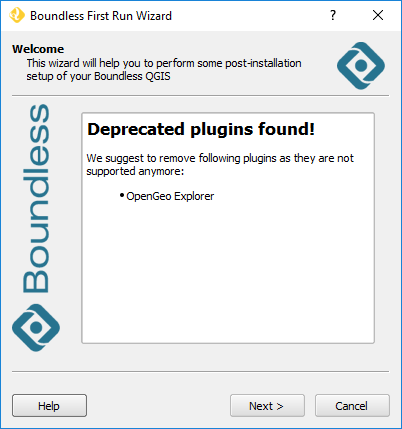
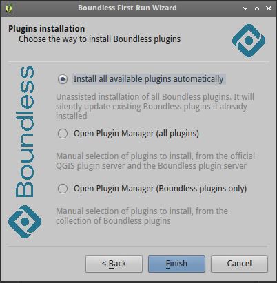
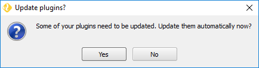
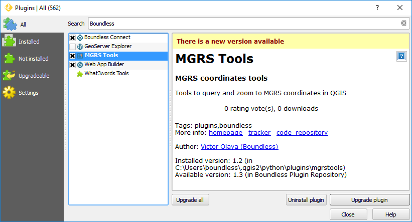

Usage
=====

When QGIS is started with the |connect_plugin| (it's activated by default in
|BLQGIS|) it checks if there are Boundless plugins installed or not. Then,
depending on the result of this check, one of the following scenarios will be
activated:

* If **all Boundless plugins are found and they are the latest version**, the
  user will be notified that no additional actions are required.
* If **all Boundless plugins are found, but some of them are outdated**, the
  |connect_plugin| will propose to update all plugins automatically. See
  :ref:`updating-plugins` section for more details.
* If **only some of Boundless plugins are installed and some of them are outdated**,
  |connect_plugin| will propose to updated installed plugins automatically. Note
  that in this case only installed Boundless plugins will be updated, additional
  plugins won't be installed.

After any of the scenarios above, the user can always review and manage
installed plugins either by using the *Plugin Manager* or by re-running the
*Boundless Connect Wizard* tool. Please see :ref:`managing-plugins` for details.

Also at this stage |connect_plugin| can update itself if it found newer version
in the *Boundless QGIS Plugins Repository*. After self-update you will need to
restart |BLQGIS| to reload |connect_plugin|.

.. _connect-wizard:

Boundless Connect Wizard
------------------------

The aim of the *Boundless Connect Wizard* is to help the user to setup the
`Boundless QGIS Plugin Repository <http://qgis.boundlessgeo.com>`_ and install
additional plugins, both Boundless and 3rd party ones (depending on what have
been configured by the system administrator).

The wizard will run automatically when QGIS is started for the first time with
the |connect_plugin| activated or whenever this plugin is updated.

If at the time, you don't want to go through the wizard, you can safely close
it. While the wizard starts automatically only once, you can open it at any
time from the :menuselection:`Plugins --> Boundless Connect Wizard` menu item.

The first wizard's page contains general information about it and what it
will do. If you have installed any unsupported Boundless plugins (deprecated
plugins that were replaced by others, e.g., OpenGeo Explorer was replaced by
GeoServer Explorer) these plugins will be listed at the welcome page suggesting
you to remove them.

   Boundless Connect Wizard welcome dialog

Please read the information on this dialog and press :guilabel:`Next` button
to go to the next step.

At this step, *Boundless Connect Wizard* will behave differently depending on
the |connect_plugin| configuration.

If your organization works with the remote *Boundless QGIS Plugin Repository*,
the wizard will ask you to enter the credentials to access the repository.
Press the :guilabel:`Add` button in the *Boundless credentials* page, as
shown below.

.. figure:: img/credentials-page.png
   :align: center

   Boundless credentials page

.. note::

   If you haven't done this before, QGIS will ask you to set a master password.
   This password will be used to store all your credentials inside QGIS, e.g.,
   username and password  for connecting spatial databases. Choose the password
   wiselly and make sure you memorize it, as **the password is not retrivable**.
   Press :guilabel:`Save` to go to the next dialog.

   .. figure:: img/add-master-password.png
      :align: center

   Setting QGIS master authentication password

In the next dialog, enter the provided Boundless credentials as shown below,
and press :guilabel:`Save` to store the credentials in QGIS authentication
database.

.. figure:: img/enter-credentials.png
   :align: center

   Saving Boundless credentials

If the |connect_plugin| was configured to use a local directory-based
repository, all the authentication steps will be skipped.

In the next wizard's page, the user has four options:

* :guilabel:`Install all available plugins automatically`, will silently
  install and/or update all Boundless plugins (both from the QGIS Official
  Plugins Repository or the ones available to him in the Boundless QGIS Plugins
  Repository).
* :guilabel:`Open Plugin Manager (all plugins)`, will open the QGIS *Plugin Manager*,
  where the user can manually choose which plugins to install (includes all
  plugins available in both repositories).
* :guilabel:`Open Plugin Manager (Boundless plugins only)` will open the QGIS
  *Plugin Manager* as well, but showing only Boundless plugins available, making
  them easier to find.
* :guilabel:`Install plugin from ZIP package` will show file selector dialog and
  allow you to select plugin ZIP package to install.

   Plugin installation page

.. note::

   Deprecated Boundless plugins will not be installed automatically. But, if
   you already have such plugins installed and there are new versions available,
   they will be updated.

.. note::

   If :guilabel:`Open Plugin Manager (Boundless plugins only)` option is
   selected |connect_plugin| will open *Plugin Manager* with
   :guilabel:`Not Installed` tab activated by default. At this tab you will see
   only Boundless plugins available from the *Boundless QGIS Plugin Repository*.
   At the same time at the :guilabel:`Installed` tab you will see all core C++
   plugins as well as all Python plugins (Boundless and 3rd paty) installed in
   your QGIS.

.. note::

   If :guilabel:`Install plugin from ZIP package` option is selected
   |connect_plugin| will ask you to select plugin ZIP package. Selected plugin
   will be installed after closing wizard with :guilabel:`Finish` button.

   This functionality also available from
   :menuselection:`Plugins --> Install plugin from ZIP` menu, see :ref:`from-zip-package`
   for more details.

After this, if previously configured by the system administrator,
|connect_plugin| will install additional plugins (see :ref:`add-additional-plugins`
section for more details about it).

.. _updating-plugins:

Updating plugins
----------------

If during the first run of |connect_plugin| (or after its update) is found that
all Boundless plugins are already installed, but some of them are outdated, it
will propose you to update those plugins automatically.

   Boundless Connect Wizard suggesting to automatically update all plugins.

If you press the :guilabel:`Update` button, all installed Boundless plugins will
be updated automatically. Note that you can always update the plugins manually
using the *Plugin Manager* (see :ref:'managing-plugins' for more details).

.. note::

   During installation (or update) of plugins, a dialog will open showing the
   plugin's download progress bar. If you choose to install (or update) two or
   more plugins at once, the *Plugin Manager* will show this dialog several
   times. This is perfectly normal; there is no cause for alarm.

Plugins installation
--------------------

Using |connect_plugin|, plugin installation can be performed in several
different ways:

* :ref:`from-remote-repository`
* :ref:`from-local-repository` (through |connect_plugin| only)
* :ref:`from-zip-package` (through |connect_plugin| only)

.. _from-remote-repository:

From a remote plugin repository
...............................

This is the most common way to install plugins, whether from QGIS Official
Plugins Repository, Boundless QGIS Plugins Repository or any other remote
repository that you may have configured, using the *Plugin Manager* directly
or through the *Boundless Connect Wizard* tool.

.. note::

   If your organization works with the remote *Boundless QGIS Plugin Repository*
   it will be necessary to provide credentials to fully access the repository.
   This can be done using the :ref:`connect-wizard` as described above or
   setting them manually using the QGIS *Plugin Manager* settings.

.. _from-local-repository:

From a local repository
.......................

Using |connect_plugin| it's possible to use a local path or network path as
a repository (see :ref:`configure-repository-location` section for details on
how to set a local repository). If any repository was set that way, the
|connect_plugin| will add an additional menu item in :menuselection:`Plugins`
named :guilabel:`Manage plugins (local folder)`. This tool should be used when
the user wants to install plugins from a local (directory-based) repository.
The usage is similar to the *Plugin Manager*.

To active, deactivate or uninstall plugins from a local repository, either the
*Plugin Manager* or the *Manage plugins (local folder)* tool can be used.

.. Note::

   Since the QGIS *Plugin Manager* does not support directory-based repositories
   yet, when you uninstall a plugin, previously installed from Boundless local
   directory-based repository, the following warning will be shown.

   .. figure:: img/plugin-uninstall.png
      :align: center

   This warning can be safely ignored, as you can install or uninstalled the
   plugin again using :menuselection:`Plugins --> Manage plugins (local folder)`
   menu item.

.. _from-zip-package:

From a plugin ZIP package
.........................

If you have a plugin package (e.g. previously downloaded from any repository or
GitHub) you can easily install it using the |connect_plugin|, without the need
to unpackage it. Go to :menuselection:`Plugins --> Install plugin from ZIP`,
browse to the directory with plugin zip package and select the corresponding
file. If the zip file is a valid QGIS plugin package it will be installed and
activated.

To deactivate or remove plugins installed whis way, like before, one can use
QGIS *Plugin Manager* from :menuselection:`Plugins --> Manage and Install Plugins...`
menu item.

.. _managing-plugins:

Managing plugins
----------------

All plugins added by |connect_plugin| can be deactivated, uninstalled or
updated using QGIS *Plugin Manager*. You can access it via the
:menuselection:`Plugins --> Manage and Install Plugins...` menu item or, for
more selective options, re-running the :ref:`connect-wizard` tool.

   Plugin Manager
