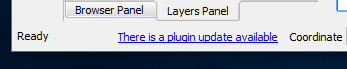
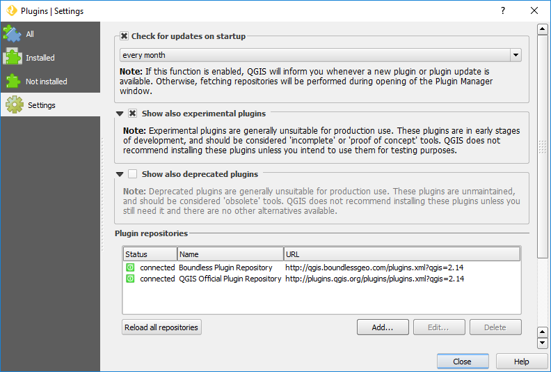

Usage
=====

.. _connect-tool:

Boundless Connect tool
----------------------

The aim of the *Boundless Connect* tool is to help the user to setup the
`Boundless QGIS Plugin Repository <http://qgis.boundlessgeo.com>`_ and install
additional plugins, both Boundless and 3rd party ones (depending on what have
been configured by the system administrator).

The tool will run automatically when QGIS is started for the first time with
the |connect_plugin| activated or whenever this plugin is updated.

.. figure:: img/connect-dialog.png
   :align: center

   Boundless Connect tool

If at the time, you don't want to enter your credentials and install plugins,
you can safely close it. While the tool starts automatically only once, you can
open it at any time from the :menuselection:`Plugins --> Boundless Connect`
menu item.

If your organization works with the remote *Boundless QGIS Plugin Repository*,
you  will need to enter the credentials to access the repository.

If the |connect_plugin| was configured to use a local directory-based
repository (check this with your sysadmin), you can safely leave
:guilabel:`Email` and :guilabel:`Password` fields empty. In this case you won't
be asked for master password.

After pressing :guilabel:`OK` button |connect_plugin| will save your credentials
(if you enetered them).

.. note::

   If you haven't done this before, QGIS will ask you to set a master password.
   This password will be used to store all your credentials inside QGIS, e.g.,
   username and password  for connecting spatial databases. Choose the password
   wiselly and make sure you memorize it, as **the password is not retrivable**.
   Press :guilabel:`Save` to complete operation.

   .. figure:: img/add-master-password.png
      :align: center

   Setting QGIS master authentication password

   If you already have master password, you will be asked to enter it to unlock
   QGIS authentication database and save your credentials in it.

   .. figure:: img/enter-master-password.png
      :align: center

   Entering QGIS master authentication password

After this it will open QGIS *Plugin Manager* with only Boundless plugins
available, making them easier to find and install them.

.. note::

   *Plugin Manager* in this case opened with :guilabel:`Not Installed` tab
   activated by default. At this tab you will see only Boundless plugins
   available from the *Boundless QGIS Plugin Repository*. At the same time at
   the :guilabel:`Installed` tab you will see all core C++ plugins as well as
   all Python plugins (Boundless and 3rd paty) installed in your QGIS.

After this, if previously configured by the system administrator,
|connect_plugin| will install additional plugins (see :ref:`add-additional-plugins`
section for more details about it).

Also |connect_plugin| will configure your |BLQGIS| to check for plugin updates
every month. When plugin update available, you will see corresponding message
in QGIS statusbar

   Plugin update available

If you don't want be notified about plugin updates or want check for updates
more frequently, open *Plugin Manager* from
:menuselection:`Plugins --> Manage and Install Plugins...` menu, go to the
:guilabel:`Settings` tab and edit options.

   Configuring check for updates

.. _updating-plugins:

Updating plugins
----------------

If after QGIS start |connect_plugin| is found that all or some Boundless plugins
are already installed, but some of them are outdated, it will propose you to
update those plugins automatically.

.. figure:: img/ask-update.png
   :align: center

   Boundless Connect Wizard suggesting to automatically update all plugins.

If you press the :guilabel:`Update` button, all installed Boundless plugins will
be updated automatically. Note that you can always update the plugins manually
using the *Plugin Manager* (see :ref:'managing-plugins' for more details).

.. note::

   During installation (or update) of plugins, a dialog will open showing the
   plugin's download progress bar. If you choose to install (or update) two or
   more plugins at once, the *Plugin Manager* will show this dialog several
   times. This is perfectly normal; there is no cause for alarm.

Plugins installation
--------------------

Using |connect_plugin|, plugin installation can be performed in several
different ways:

* :ref:`from-remote-repository`
* :ref:`from-local-repository` (through |connect_plugin| only)
* :ref:`from-zip-package` (through |connect_plugin| only)

.. _from-remote-repository:

From a remote plugin repository
...............................

This is the most common way to install plugins, whether from QGIS Official
Plugins Repository, Boundless QGIS Plugins Repository or any other remote
repository that you may have configured, using the *Plugin Manager* directly
or through the *Boundless Connect Wizard* tool.

.. note::

   If your organization works with the remote *Boundless QGIS Plugin Repository*
   it will be necessary to provide credentials to fully access the repository.
   This can be done using the :ref:`connect-tool` as described above or
   setting them manually using the QGIS *Plugin Manager* settings.

.. _from-local-repository:

From a local repository
.......................

Using |connect_plugin| it's possible to use a local path or network path as
a repository (see :ref:`configure-repository-location` section for details on
how to set a local repository). If any repository was set that way, the
|connect_plugin| will add an additional menu item in :menuselection:`Plugins`
named :guilabel:`Manage plugins (local folder)`. This tool should be used when
the user wants to install plugins from a local (directory-based) repository.
The usage is similar to the *Plugin Manager*.

To active, deactivate or uninstall plugins from a local repository, either the
*Plugin Manager* or the *Manage plugins (local folder)* tool can be used.

.. Note::

   Since the QGIS *Plugin Manager* does not support directory-based repositories
   yet, when you uninstall a plugin, previously installed from Boundless local
   directory-based repository, the following warning will be shown.

   .. figure:: img/plugin-uninstall.png
      :align: center

   This warning can be safely ignored, as you can install or uninstalled the
   plugin again using :menuselection:`Plugins --> Manage plugins (local folder)`
   menu item.

.. _from-zip-package:

From a plugin ZIP package
.........................

If you have a plugin package (e.g. previously downloaded from any repository or
GitHub) you can easily install it using the |connect_plugin|, without the need
to unpackage it. Go to :menuselection:`Plugins --> Install plugin from ZIP`,
browse to the directory with plugin zip package and select the corresponding
file. If the zip file is a valid QGIS plugin package it will be installed and
activated.

To deactivate or remove plugins installed whis way, like before, one can use
QGIS *Plugin Manager* from :menuselection:`Plugins --> Manage and Install Plugins...`
menu item.

.. _managing-plugins:

Managing plugins
----------------

All plugins added by |connect_plugin| can be deactivated, uninstalled or
updated using QGIS *Plugin Manager*. You can access it via the
:menuselection:`Plugins --> Manage and Install Plugins...` menu item.

.. figure:: img/managing-plugins.png
   :align: center

   Plugin Manager
